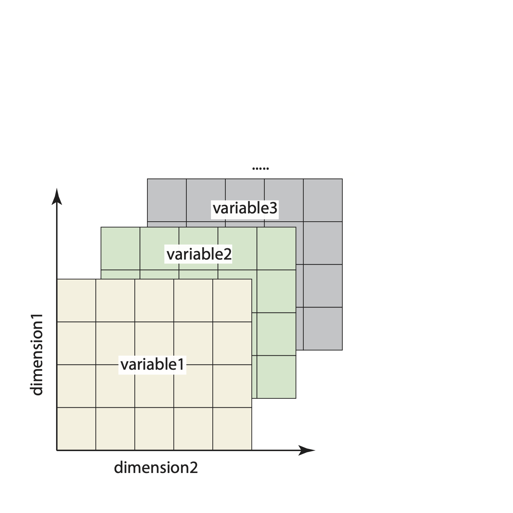
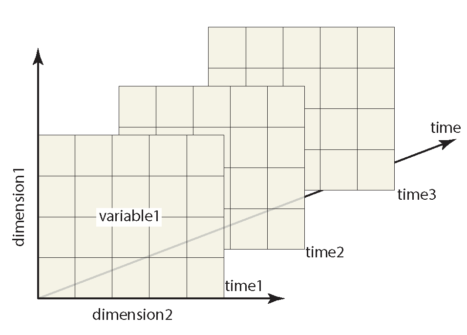
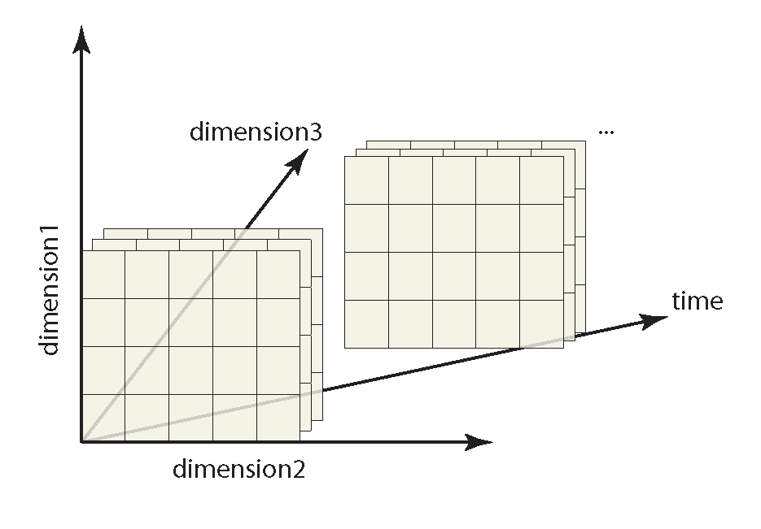

# Convert text files to netCDF formats

The purpose of this script is to help people who are new to using netCDFs, convert their data into a netCDF format. This script was written to help users upload their data to the Datalakes platform (https://www.datalakes-eawag.ch/?home) , but is generic enough that it can be used for other purposes. 

## What is a netCDF?

A netCDF (Network Common Data Format) is a file format that is very effecient for storing and sharing multi-dimensional data. The files are also capable of storing metadata so they are self-describing. The data is stored in a series of arrays that makes it easy to extract portions of the data (without reading in the entire file) and append additional data.

## Examples of how data can be stored in netCDFs:

**Two-dimensional data** (e.e. temperature, salinity and oxygen saturation over an area)

In this case, variable1 = temperature, variable2 = salinity, variable3 = oxygen saturation, dimension1 = latitude, dimension2 = longitude, and you can add additional variables that were measured within the same lat/lon)

**Three-dimensional data** (e.g. temperature over an area varying with time)

In this case, variable1 = temperature, dimension1 = latitude, dimension2 = longitude, and its varying through time (which is the unlimited dimension -- e.g. you can add additional timesteps)

**Four-dimensional data** (e.g. temperature over an area at various depths, varying through time)

In this case, variable1 = temperature, dimension1 = latitude, dimension2 = longitude, dimension3 = depth, and its varying through time (which is the unlimited dimension -- e.g. you can add additional timesteps). 

## Components of a netCDF 

### Variables 

 A variable is an array that stores the actual data (e.g. temperature, salinity, etc). Each variable has a name, data types and is defined by one or more dimensions.

### Dimensions

A netCDF dimension has a name and a size. For hydrology data, common dimensions are latitutde, longitutude, time, depth, etc. There can be only one unlimited dimension in a netCDF. The unlimited dimension does not have a fixed size, so it can "grow" in that direction (e.g. time series data can be continously appended). 

### Coordinate variables

A coordinate variable is a 1D variable with the same name as its dimension (e.g. time). It provides the actual values along that dimension (e.g. specific dates/times). 

### Attributes

These can store metadata/information about the data. Attributes can be specific to a variable (e.g. units, missing value code, valid range, etc.) or they can be global attributes (e.g. data source, creation date, conventions used, etc.).

## Additional netCDF resources

The unidata NetCDF user's guide: https://docs.unidata.ucar.edu/nug/current/index.html#netcdf_purpose

ArcGIS also has a good explanation : https://desktop.arcgis.com/en/arcmap/latest/manage-data/netcdf/fundamentals-of-netcdf-data-storage.htm

